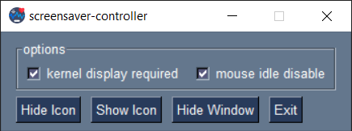

# screensaver-controller



Small python application for Windows, that will allow you to use remote desktop on one of the monitors without having to constantly unlock the screen (regardless of AD settings).

## run
Double click screensaver-controller.exe or
```bash
python3 screensaver-controller.pyw
```

## requirements for pyw
Python >= 3 and
```bash
pip3 install PySimpleGUI
pip3 install psgtray
pip3 install mouse
pip3 install keyboard
```

## features
* two independent modes - kernel display required and mouse idle disable (both active on startup)
* gui window with options panel
* ability to hide the gui (autohide on startup)
* tray icon
